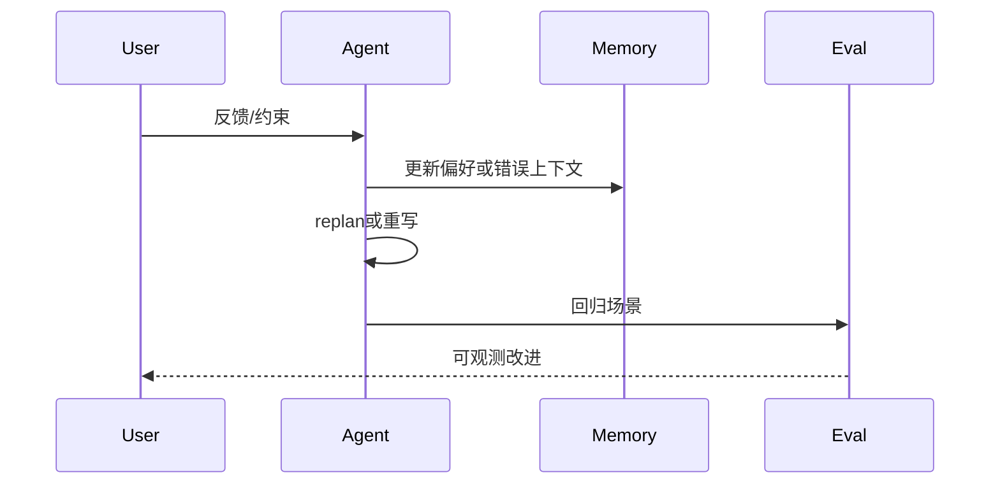

# Case Study 02 — 反馈闭环 / 自愈循环

> **模板**：复制到 [`../personal/case-study-02.md`](../personal/README.md) 后填写。**`personal/` 已 gitignore，勿提交公开仓。**

## 场景（TrackARuntime 主线 + M6 可选扩展）

- **TrackARuntime（默认）**：`cli.py run` replan 闭环；`cli.py harness` 护栏失败→自愈/回滚
- **A. TravelRouteMemo（M6 可选）**：用户修改偏好 → memory 更新 → 下次规划变化
- **B. System Guardian（M6 可选）**：generate → guardrail fail → feed error → 自愈通过

选定：TrackARuntime / A / B

## 闭环图

## 证据

- Trace / memory 文件路径：
- Eval 对比（前 vs 后）：

## 指标

| 指标 | 变更前 | 变更后 |
|---|---|---|
| 场景通过率 | | |
| 用户采纳率 | | |

## 面试要点

- 为何不用「一次 Prompt 搞定」：
- 闭环如何可验证：
