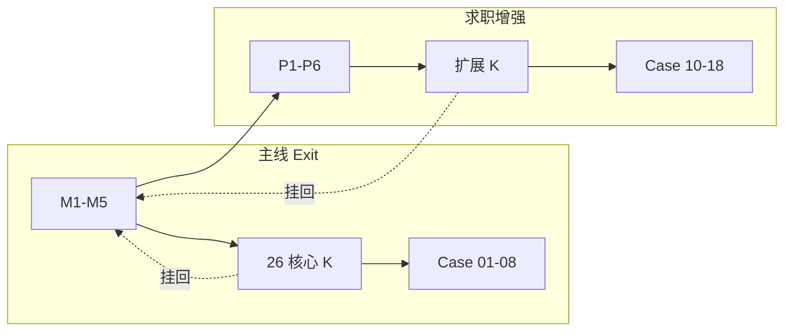
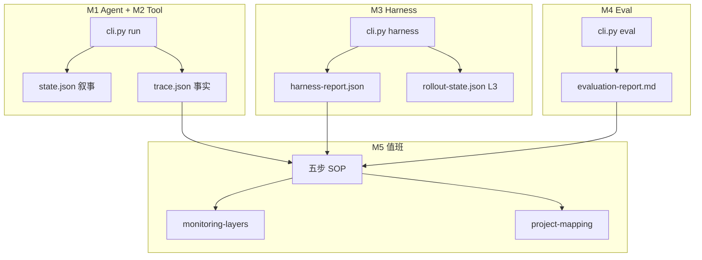

# Track A 知识地图 · 纯索引速查

> **定位**：**检索用**——术语、26 K 点表、命令、跨模块对照。  
> **系统学习（Greenhand）**：先读 [`KNOWLEDGE-SYSTEM.md`](curriculum/00-knowledge-system.md) → [`COURSE.md`](curriculum/01-course.md)  
> **求职增强**：核心 Exit 后读 [`Production Extension Packs`](curriculum/02-production-extension-packs.md)，把真实 LLM/RAG/安全/分布式 runtime/观测追问并回 M1–M5。  
> **K 点 What/Why/How 详卡**：各 [`module-XX/knowledge.md`](module-01/knowledge.md)

---

## 1. 怎么用

| 场景 | 读什么 |
|---|---|
| **Greenhand 首次学习** | [`KNOWLEDGE-SYSTEM.md`](curriculum/00-knowledge-system.md)（含 **§7.1**）→ [`COURSE.md`](curriculum/01-course.md) → `module-XX/knowledge.md` |
| 进新模块复习机理 | `KNOWLEDGE-SYSTEM.md` §7 + §7.1 + `COURSE.md` 对应章 |
| 面试前 30 分钟 | 本文件 §2 考核句 + §8 命令 + [`02-production-extension-packs.md`](curriculum/02-production-extension-packs.md) §2 |
| 查术语 / K 点编号 | 本文件 §4、§7 |
| **分不清 M / K / P** | 本文件 **§2.5** → 根目录 [`USAGE.md`](../USAGE.md) §1.0 |

**能力递进**（全轨道统一）：**L1** 能讲清 · **L2** 能对照 runtime debug · **L3** 能设计策略/扩展代码（见 [`tutor/README.md`](tutor/README.md)）。

---

## 2. 模块考核句链（五条生命线）

> 生命线推导：[`KNOWLEDGE-SYSTEM.md` §2](curriculum/00-knowledge-system.md)

```text
M1 控制面   → 我会 Agent 闭环
M2 工具边界 → 我会 Tool + Trace
M3 配置交付 → 我会 Harness
M4 质量门禁 → 我会 Eval
M5 运维响应 → 我会值班思维
```

| 模块 | 考核句 | 一句话证明什么 | 主证据 |
|---|---|---|---|
| **M1** | **我会 Agent 闭环** | plan→act→observe→replan；fatal interrupt；Mock plan / checkpoint | `state` + `trace` + `metrics` · `run --llm mock` |
| **M2** | **我会 Tool + Trace** | allowlist→schema→HITL；timeout/stalled | `trace.json` · demo / `--require-hitl` |
| **M3** | **我会 Harness** | Prompt 版本化、灰度、护栏、回滚；平台 stub | `harness-report.json` · `harness` |
| **M4** | **我会 Eval** | scenarios + taxonomy + baseline/auto + gate_pass | `evaluation-report` · `eval --baseline auto` |
| **M5** | **我会值班思维** | 五步 SOP + 监控分层（含 metrics）+ Case 映射 | `monitoring-layers` · `project-mapping` |

---

## 2.5 M 模块 · K 点 · P 扩展包 关系图

> **简版定义与决策表**：根目录 [`USAGE.md`](../USAGE.md) §1.0 · **Px 权威定义**：[`02-production-extension-packs.md`](curriculum/02-production-extension-packs.md)

### 三层各自管什么

```text
M1–M5（模块）      五条工程生命线 — 「系统由哪几块组成」
    ↓ 每模块拆成
Mx-Kyy（K 点）     可考核的知识工程点 — 「这块要会什么、怎么证明」
    ↓ 核心 Exit 后，按求职追问打包为
P1–P6（扩展包）    生产纵深主题 — 「岗位还会追问什么」→ 仍挂回 M，并增补扩展 K
```

| 层 | 数量 | Exit 要求 | 主要文档 |
|---|---|---|---|
| **M** | 5 | 每周一个模块 | `00-knowledge-system` · `01-course` · `module-0N/` |
| **核心 K** | 26 | 核心 Exit：均分 ≥2.0 且 ≥1 个 K=3 | `module-XX/knowledge.md` · 本文件 §5、§7 |
| **扩展 K** | +15 | 求职增强 Exit：可选 | 本文件 §7.1 · `02` §9 |
| **P** | 6 | 求职增强：P1–P6 各能讲 1 Case | `02` §2–§8 |

### P1–P6 ↔ 模块 ↔ Case ↔ 扩展 K

| Px | 主题（`02` 节） | 主归属 M | 代表 Case | 主要扩展 K |
|---|---|---|---|---|
| **P1** | §3 Gateway / Cost / Rate Limit | M3 | 10 | M3-K07、K09；M5-K07 |
| **P2** | §4 RAG + Knowledge | M4 | 11 | M4-K06、K08 |
| **P3** | §5 Security + Sandbox | M2 | 12、17 | M2-K06–K09；M4-K09 |
| **P4** | §6 Runtime Scale + Memory | M1 | 13、14 | M1-K07、K08 |
| **P5** | §7 Eval Reliability + Red Team | M4 | 15、14 | M4-K07、K09 |
| **P6** | §8 Observability + SLO | M5 | 16、18 | M5-K05、K06 |

### 阅读顺序（按场景）

| 场景 | 顺序 |
|---|---|
| **主线第 N 周** | M_N → `01-course` 第 N 课 → 核心 K（§5）→ Case 01–08（`01-course` §N.0.1）→ TrackARuntime |
| **啃不动 Case 01–08** | Case **补强 K 点** → `module-XX/knowledge` → `01-course` 第 N 课 |
| **啃不动 Case 10–18** | Case **目标扩展包 Px** → `02` 对应 §3–§8 → **扩展 K**（§7.1）→ SOP → Runtime |
| **面试追问 Gateway / RAG / 安全…** | `02` §2 定位 Px → 上表找 Case → [`demo-script`](../portfolio/demo-script.md) §4 |



---

## 3. 全局架构（TrackARuntime）

> 模块依赖与生命线说明：[`KNOWLEDGE-SYSTEM.md` §4–§6](curriculum/00-knowledge-system.md)



---

## 4. 术语与缩略语

| 缩写 | 全称 | 在本项目中的含义 |
|---|---|---|
| **Agent loop** | Agent Loop（代理闭环） | plan → act → observe → replan 有状态任务机（非 Chat） |
| **FSM** | Finite State Machine（有限状态机） | M1 Phase / round 状态机 |
| **Saga** | Saga Pattern（长事务补偿模式） | replan = forward recovery；fatal = abort（见 [study-notes/saga-compensation.md](study-notes/saga-compensation.md)） |
| **OBS** | Observe（观察/信号） | Case 库故障轴：observe 信号层级（见 §6） |
| **CTL** | Control（控制面） | Case 库故障轴：控制面未 enforce（见 §6） |
| **CTX** | Context（上下文） | Case 库故障轴：上下文/记忆（见 §6） |
| **KNW** | Knowledge（知识/检索） | Case 库故障轴：检索与知识（见 §6） |
| **REL** | Release / Reliability（交付与变更） | Case 库故障轴：灰度、回归、回滚（见 §6） |
| **SEC** | Security（安全） | Case 库故障轴：信任边界（见 §6） |
| **MET** | Metrics（度量） | Case 库故障轴：实验与 eval 偏差（见 §6） |
| **RPC** | Remote Procedure Call（远程过程调用） | M2：Tool = 带副作用的受控 RPC |
| **OTel** | OpenTelemetry | M2：TraceEvent ≈ span |
| **Harness** | Harness（交付/编排层） | M3：Prompt/配置的交付层（非模型本身） |
| **Canary** | Canary release（金丝雀发布） | `gray_percent` 小流量试新版本 |
| **Feature flag** | Feature Flag（特性开关） | v1/v2 Prompt 分流 |
| **SLO** | Service Level Objective（服务等级目标） | 护栏目标线（如 `style_formality_min`）；亦为故障轴「性能/容量」 |
| **SLI** | Service Level Indicator（服务等级指标） | 实测指标（如 `formality_score`） |
| **Blue-green** | Blue-green deployment（蓝绿部署） | 双版本切换；v1↔v2 rollback 同构 |
| **Eval / gate** | Evaluation / Quality Gate（评测 / 质量门禁） | M4：`gate_pass = success_rate ≥ baseline` |
| **Taxonomy** | Failure Taxonomy（失败分类法） | M4：失败分类码（非仅 pass/fail%） |
| **RAG** | Retrieval-Augmented Generation（检索增强生成） | M4 概念级；非 Track A 主轴 |
| **TTFT** | Time To First Token（首 Token 时延） | M5 Case 7：模型层延迟指标 |
| **SOP** | Standard Operating Procedure（标准作业程序） | M5：观察→隔离→定位→修复→复盘（见 [study-notes/five-step-incident-sop.md](study-notes/five-step-incident-sop.md)） |
| **A/B** | A/B Testing（对照实验） | Case 8 防幸存者偏差 |
| **CI** | Continuous Integration（持续集成） | M4 L3：gate_pass false → block merge |
| **OSS** | Open Source Software（开源软件） | `case-library/oss-incidents/` 真实 Issue |
| **LLM** | Large Language Model（大语言模型） | 本轨道 runtime 不接真实推理 API |
| **API** | Application Programming Interface（应用程序接口） | TrackARuntime Cannot：生产 LLM API |
| **KPI** | Key Performance Indicator（关键绩效指标） | 护栏/实验多指标；防单一 KPI |
| **CLI** | Command-Line Interface（命令行界面） | `cli.py` 证据命令入口 |
| **PR** | Pull Request（拉取请求） | OSS Issue/PR 校准 |
| **UI** | User Interface（用户界面） | M3-K03 L3 dashboard 设计级 |
| **JSON** | JavaScript Object Notation | `state.json` / `trace.json` 等本地证据 |

---

## 5. 分模块 K 点速查

> **What / Why / How 矩阵**：[`KNOWLEDGE-SYSTEM.md` §7](curriculum/00-knowledge-system.md) · **详卡 + Prove**：各 `module-XX/knowledge.md`

### M1 · Agent 闭环（6 K 点）

**考核句**：能讲清 plan→act→observe→replan；对照 `state.json`/`trace.json` 说明 **为何停、为何继续**；fatal 必须 interrupt。

| K 点 | 核心 | L2 证据 | 主 Issue |
|---|---|---|---|
| **K01** | Agent = 状态机非 Chat；四层 context | `state.json` phase/round；`context_manager` | 全模块基础 |
| **K02** | observe = 结构化信号 | `[retryable]` vs `error_class: fatal` | #803 OBS |
| **K03** | replan + 可选 MockLLM | round2 plan 引用 observation；`--llm mock` | #5099；Mock **无独立 Issue** |
| **K04** | 多层终止 + checkpoint | DONE 原因；checkpoint/resume | #803；**I05** |
| **K05** | recoverable / fatal 分类 | A/B success vs container death | #803 / #4575 |
| **K06** | fingerprint 无进展 loop | 相同 command×3 → fatal | #4579 / #5099 |

**命令**：`run --llm mock` · `--simulate-container-death 1` · `--always-fail-tests --max-rounds 5` · `--pseudo-replan` · `--checkpoint-dir` / `--resume-from`

**深读**：[module-01/knowledge.md](module-01/knowledge.md) · [oss-803/4575/4579/5099](case-library/oss-incidents/)

---

### M2 · Tool + Trace（5 K 点）

**考核句**：tool 受控可审计；**allowlist→schema→HITL**；observe 契约含 **timeout / stalled** 两极。

| K 点 | 核心 | L2 证据 | 主 Issue |
|---|---|---|---|
| **K01** | Tool = allowlist RPC（只读沙箱有、主 loop 默认未用） | `demo-allowlist` | Case 6 |
| **K02** | Trace = 可回放图 | 逐步讲 `trace.json` | #8448 / I02 |
| **K03** | 三层防御 allowlist→schema→HITL | schema 拒绝；`--require-hitl` | **I03 / I04** |
| **K04** | 分路径 timeout（配置有 / enforce 无） | `_timeouts` dict | #7355 / I01 |
| **K05** | timeout ≠ kill | pending→stalled | #8448 / I02 |

**命令**：`demo-allowlist` · `demo-no-output-hang` · `run --require-hitl` · `unittest tests.test_tool_executor`

**深读**：[module-02/knowledge.md](module-02/knowledge.md) · [module-02/issues.md](module-02/issues.md)

---

### M3 · Harness（6 K 点）

**考核句**：Prompt 版本化、灰度护栏、可回滚；**不靠换模型救火**；知晓 router/cost **stub**。

| K 点 | 核心 | L2 证据 | 主 Issue/Case |
|---|---|---|---|
| **K01** | Harness = 交付层 + 平台 stub | `harness-report`；`metrics` route/cost | vs Agent loop；stub **无独立 Issue** |
| **K02** | Prompt = 代码（v1/v2/changelog） | yaml diff | Case 2 / I02 |
| **K03** | 护栏 formality（成本只记账） | `formality_score` | Case 2/8 |
| **K04** | rollback_to_v1 | gray fail → rollback | L3: `--watch` |
| **K05** | gray / Canary | `gray_percent=10` | Case 8 |
| **K06** | re-ask 上限 / 边界 | #1491 IndexError | I01 / PR #1492 |

**命令**：`harness --prompt v2 --gray-percent 10` · `harness --prompt v1 --gray-percent 0` · `harness --watch` · `--reset-rollout`

**深读**：[module-03/knowledge.md](module-03/knowledge.md) · [rollout-auto-rollback.md](study-notes/rollout-auto-rollback.md)

---

### M4 · Eval（5 K 点）

**考核句**：固定任务集 + failure taxonomy + **gate_pass**；baseline **auto 或固定**；知 `_simulate` 与 `trace_eval` 未接线。

| K 点 | 核心 | L2 证据 | 主 Issue |
|---|---|---|---|
| **K01** | Eval = scenarios（`_simulate`） | **22** 条 + category/version | SWE-bench 类比 |
| **K02** | taxonomy + remediation | Top3 + 建议字段 | Case 1/8；**I03** |
| **K03** | gate_pass；baseline auto/0.45 | `baseline_meta` / CI **0.45** | #929；**I03** |
| **K04** | 检索 vs 生成拆分 | `category_split` | #9415 / I02 |
| **K05** | trace-based metric | `trace_eval` 有库、**未进 runner** | #2643 / I01 |

**命令**：`python cli.py eval --baseline auto` · 对照 `eval --baseline 0.45`（CI，见 [`TrackARuntime/README.md`](../TrackARuntime/README.md)）

**深读**：[module-04/knowledge.md](module-04/knowledge.md) · [module-04/issues.md](module-04/issues.md)

---

### M5 · 值班思维（4 K 点）

**考核句**：五步 SOP + 监控分层（含 **metrics**）+ 项目映射；串 trace/harness/eval **故障叙事**。

| K 点 | 核心 | L2 证据 | 深 Case |
|---|---|---|---|
| **K01** | 五步 SOP | Case 7 时间线 | 2,3,6,7 |
| **K02** | 系统等价物 | 每 Case 1 句 | 跨 Case 模式 |
| **K03** | 监控五层 + metrics | monitoring-layers；`metrics-*.json` | Case 7 TTFT |
| **K04** | project-mapping | 现象→监控→证据→回滚 | ≥4 行深 Case |

**材料**：[monitoring-layers.md](module-05/monitoring-layers.md) · [project-mapping.md](module-05/project-mapping.md) · [sops/](case-library/sops/)

**深读**：[module-05/knowledge.md](module-05/knowledge.md) · [five-step-incident-sop.md](study-notes/five-step-incident-sop.md)

---

## 6. 故障分类轴 × 模块覆盖

> 完整定义与 M5 角色：[`KNOWLEDGE-SYSTEM.md` §8](curriculum/00-knowledge-system.md) · [`case-library/README.md`](case-library/README.md)

| 类别 | 全称 | 含义 | 主模块 | 代表 Case/OSS |
|---|---|---|---|---|
| **OBS** | Observe（观察/信号） | observe 信号层级错 | M1 | oss-803 |
| **CTL** | Control（控制面） | 控制面未 enforce | M1 | oss-4575/4579/5099 |
| **CTX** | Context（上下文） | 上下文/记忆 | M1/M4 | Case 3 |
| **KNW** | Knowledge（知识/检索） | 检索与知识 | M4 | Case 1/4 · oss-9415 |
| **REL** | Release / Reliability（交付与变更） | 交付与变更 | M3 | Case 2/5 · oss-1491 |
| **SEC** | Security（安全） | 信任边界 | M2 | Case 6 |
| **SLO** | Service Level Objective（服务等级目标） | 性能/容量 | M2 | Case 7 |
| **MET** | Metrics（度量） | 度量与实验 | M3/M4 | Case 8 · oss-929/2643 |

**M5 作用**：把上表 **在线化** —— 告警先亮哪一层、打开哪个证据文件、隔离/回滚什么。

---

## 7. K 点总表（26 核心点 + 生产扩展点）

| ID | 模块 | 关键词 | Runtime 锚点 |
|---|---|---|---|
| M1-K01 | M1 | 状态机 + context | `loop_engine.py` · `context_manager.py` |
| M1-K02 | M1 | observe 信号 | `_observe_tests` |
| M1-K03 | M1 | replan / MockLLM | `_make_plan` · `llm_client.py` |
| M1-K04 | M1 | 终止 / checkpoint | `LoopConfig` · checkpoint/resume |
| M1-K05 | M1 | fatal/recoverable | `errors.py` |
| M1-K06 | M1 | fingerprint | `_check_fingerprint_loop` |
| M2-K01 | M2 | allowlist / 只读沙箱 | `ALLOWLIST` · `read_file`/`grep` |
| M2-K02 | M2 | trace 图 | `trace.py` |
| M2-K03 | M2 | schema + HITL | `ToolSpec` · `--require-hitl` |
| M2-K04 | M2 | timeout tier | `_timeouts`（未 enforce） |
| M2-K05 | M2 | timeout≠kill | `demo-no-output-hang` |
| M3-K01 | M3 | Harness + 平台 stub | `pipeline.py` · router/cost |
| M3-K02 | M3 | Prompt 版本 | `prompts/*.yaml` |
| M3-K03 | M3 | 护栏 SLO | `guardrails.py` |
| M3-K04 | M3 | rollback | `rollout_controller.py` |
| M3-K05 | M3 | gray/Canary | `gray_percent` |
| M3-K06 | M3 | re-ask 上限 | #1491 概念 |
| M4-K01 | M4 | scenarios / `_simulate` | `scenarios.json` |
| M4-K02 | M4 | taxonomy + remediation | `failure_taxonomy.md` |
| M4-K03 | M4 | gate / baseline auto | `baseline.py` |
| M4-K04 | M4 | 检索 vs 生成 | `category_split` |
| M4-K05 | M4 | loop metric | `trace_eval.py`（未接 runner） |
| M5-K01 | M5 | 五步 SOP | `sops/` |
| M5-K02 | M5 | 系统等价物 | Case 库 |
| M5-K03 | M5 | 监控分层 + metrics | `monitoring-layers.md` |
| M5-K04 | M5 | 项目映射 | `project-mapping.md` |

### 7.1 生产扩展 K 点（求职增强）

> 扩展详解：[`02-production-extension-packs.md`](curriculum/02-production-extension-packs.md)。这些 K 点不替代 26 个核心 K；它们用于回答真实 Agent Development 岗位的生产追问。

| ID | 模块 | 关键词 | 证明方式 |
|---|---|---|---|
| M1-K07 | M1 | Runtime Scale：queue / worker / lease / idempotency | [Case 13](case-library/cases/case-13-worker-death-checkpoint-resume.md) + [SOP](case-library/sops/sop-case-13-worker-death-checkpoint-resume.md)；queue 白板 |
| M1-K08 | M1 | Memory Policy：写入、版本、回滚、污染治理 | [Case 14](case-library/cases/case-14-memory-poisoning-version-rollback.md) + [SOP](case-library/sops/sop-case-14-memory-poisoning-version-rollback.md)；memory provenance 表 |
| M1-K09 | M1 | Goal Change：cancel / interrupt / user edit | [Case 18](case-library/cases/case-18-approval-fatigue-destructive-action.md) + [SOP](case-library/sops/sop-case-18-approval-fatigue-destructive-action.md)；状态转换图 |
| M2-K06 | M2 | Policy Engine：模型外授权 | policy table；[Case 12](case-library/cases/case-12-indirect-prompt-injection-tool-abuse.md) + [SOP](case-library/sops/sop-case-12-indirect-prompt-injection-tool-abuse.md) |
| M2-K07 | M2 | Indirect Prompt Injection | SEC red team；[Case 12](case-library/cases/case-12-indirect-prompt-injection-tool-abuse.md) + [SOP](case-library/sops/sop-case-12-indirect-prompt-injection-tool-abuse.md) |
| M2-K08 | M2 | Data Boundary：PII / secret / tenant / provider | redaction rule；[Case 17](case-library/cases/case-17-secret-leakage-through-tool-trace.md) + [SOP](case-library/sops/sop-case-17-secret-leakage-through-tool-trace.md) |
| M2-K09 | M2 | HITL UX：approval granularity / undo | [Case 18](case-library/cases/case-18-approval-fatigue-destructive-action.md) + [SOP](case-library/sops/sop-case-18-approval-fatigue-destructive-action.md)；demo script |
| M3-K07 | M3 | LLM Gateway：adapter / streaming / fallback | provider taxonomy；[Case 10](case-library/cases/case-10-provider-rate-limit-fallback.md) |
| M3-K08 | M3 | Runtime Config Surface：model / prompt / retrieval / policy / memory | config review checklist |
| M3-K09 | M3 | Rate Limit & Quota Delivery | RPM/TPM/tenant quota 表；[Case 10](case-library/cases/case-10-provider-rate-limit-fallback.md) |
| M4-K06 | M4 | RAG Eval：retrieval / generation / citation | [Case 11](case-library/cases/case-11-rag-stale-index-hallucination.md)；RAG split report |
| M4-K07 | M4 | Judge Calibration | human label 对照；[Case 15](case-library/cases/case-15-judge-bias-false-regression.md) |
| M4-K08 | M4 | Eval Dataset Lifecycle | [Case 11](case-library/cases/case-11-rag-stale-index-hallucination.md)（doc/index version） / [Case 15](case-library/cases/case-15-judge-bias-false-regression.md)（rubric/judge version）；bad case 回流表 |
| M4-K09 | M4 | Security / Red Team Eval | [Case 12](case-library/cases/case-12-indirect-prompt-injection-tool-abuse.md) / [Case 14](case-library/cases/case-14-memory-poisoning-version-rollback.md)；SEC scenario set |
| M5-K05 | M5 | Observability：trace / metrics / logs / alerts / SLO | OTel span 对照；[Case 16](case-library/cases/case-16-observability-cardinality-alert-fatigue.md) + [SOP](case-library/sops/sop-case-16-observability-cardinality-alert-fatigue.md) |
| M5-K06 | M5 | Incident Feedback Loop | [Case 13](case-library/cases/case-13-worker-death-checkpoint-resume.md) / [Case 14](case-library/cases/case-14-memory-poisoning-version-rollback.md) / [Case 16](case-library/cases/case-16-observability-cardinality-alert-fatigue.md) / [Case 18](case-library/cases/case-18-approval-fatigue-destructive-action.md)；postmortem → eval/policy/prompt |
| M5-K07 | M5 | Cost & Capacity Response | 429/quota/backlog SOP；[Case 10](case-library/cases/case-10-provider-rate-limit-fallback.md) |

---

## 8. 证据命令速查（L2 最低线）

> 与 [`KNOWLEDGE-SYSTEM.md` §7.1](curriculum/00-knowledge-system.md)、[`01-course.md`](curriculum/01-course.md) 过关动作一致。

```powershell
cd TrackARuntime

# M1
python cli.py run --task "fix failing test" --llm mock
python cli.py run --task "container death" --simulate-container-death 1
python cli.py run --task "stuck loop" --always-fail-tests --max-rounds 5
python cli.py run --task "pseudo replan" --always-fail-tests --pseudo-replan --max-rounds 5

# M2
python cli.py demo-allowlist --tool rm_rf
python cli.py demo-no-output-hang --idle-timeout 1
python cli.py run --task "hitl check" --require-hitl

# M3
python cli.py harness --prompt v2 --gray-percent 10
python cli.py harness --prompt v1 --gray-percent 0
python cli.py harness --prompt v2 --gray-percent 10 --watch   # L3

# M4
python cli.py eval --baseline auto
python cli.py eval --baseline 0.45   # CI 对照

# M5（文档 + 口述，复用上列证据；观察步含 metrics-*.json）
# 填 monitoring-layers.md · project-mapping.md
```

| 产出文件 | 证明 |
|---|---|
| `m1_m2/evidence/<id>/state.json` | M1 叙事 |
| `m1_m2/evidence/<id>/trace.json` | M1/M2/M5 |
| `m1_m2/evidence/<id>/metrics-*.json` 或旁路 metrics | M1/M3/M5 成本/路由估算 |
| `m3/evidence/harness-report.json` | M3 |
| `m3/evidence/rollout-state.json` | M3-K04 L3 |
| `m4/evidence/evaluation-report.md` | M4 |

---

## 9. 跨模块对照（面试高频）

> 扩展对照：[`KNOWLEDGE-SYSTEM.md` §9](curriculum/00-knowledge-system.md)

| 对照 | 说明 |
|---|---|
| **state vs trace** | M1 叙事 vs M2 逐步事实 |
| **allowlist vs formality** | M2 入口 vs M3 出口双护栏 |
| **fingerprint vs loop metric** | M1 在线 fatal vs M4 离线 eval |
| **harness rollback vs eval gate** | M3 在线 vs M4 merge 前双门禁 |
| **#7355 vs #8448** | timeout 切太早 vs hang 永不切 |
| **Case 7 vs Case 2** | 先开 trace vs harness-report |
| **M2 设计 vs M5 值班** | mechanism 表 vs SOP 动作表 |

---

## 10. 领域知识覆盖率

> 刻意不教什么：[`KNOWLEDGE-SYSTEM.md` §6](curriculum/00-knowledge-system.md) · 本表保留明细索引

### ✅ 本轨道 **覆盖**（M1–M5 + TrackARuntime）

| 领域 | 覆盖方式 |
|---|---|
| Agent 状态机 / replan / fatal | M1 全 K + OSS 四 Issue |
| Tool 安全 / trace / timeout | M2 + Cline Issue |
| 交付 / 灰度 / 护栏 / rollback | M3 + Case 2/8 |
| 离线 eval / taxonomy / 门禁 | M4 + DeepEval/RAGFlow Issue |
| 故障响应 / 监控 / Case 映射 | M5 + Case 1–8 |
| 真实 OSS 校准 | 三日法 + `oss-incidents/` |
| 面试 drill | [`INTERVIEW-DRILLS.md`](interview/DRILLS.md) |

### ⚠️ **浅覆盖 / 概念级**（能口述，非工程主轴）

| 领域 | 说明 |
|---|---|
| RAG pipeline 实现 | Core：Case 1/4 + M4-K04 设计；求职增强见 P2 |
| Prompt 注入深度防御 | Core：Case 6 + allowlist；求职增强见 P3 |
| 多指标 dashboard UI | M3-K03 L3 设计；runtime 仅 formality |
| schema/HITL（dry-run 仍 L3） | M2-K03：**schema+HITL 已实现**；dry-run / timeout enforce 仍浅 |
| loop metric 完整接入 eval | M4-K05：`trace_eval` 有库，**未接** `run_eval` |
| re-ask counter 代码 | M3-K06 概念 + #1491；harness 未接 LLM |
| 成本硬熔断 | `CostMonitor` 只记账；无 max_cost Fatal |
| 真实只读进主 loop | `read_file`/`grep` 有能力，默认 loop 未调 |
| 真实 LLM Gateway / OTel / 分布式 queue | `02-production-extension-packs.md` 讲生产设计；TrackARuntime 未实现 |

### ❌ **未覆盖**（刻意不在 M1–M5 主线）

| 领域 | 去向 |
|---|---|
| 生产 LLM API / 真实推理 | TrackARuntime **Mock 默认**（见 DESIGN.md）；求职增强见 P1 |
| RAG 平台 / embedding 服务 | 非核心主轴；求职增强见 P2 |
| M6 作品集 / 第二项目 | 根 [`portfolio/`](../portfolio/README.md) |
| TravelRouteMemo 等业务 Agent | M6 可选 |
| 自动 merge PR | M4 L3 设计；**已有** GitHub Actions CI（unittest→harness→eval） |
| 分布式 trace 后端（Jaeger 等） | 本地 JSON 文件证据 |

---

## 11. 必要参考索引

| 类型 | 路径 |
|---|---|
| 总计划 | [`track-a-competency-plan.md`](../track-a-competency-plan.md) |
| K 点权威 | 各 `module-XX/knowledge.md` |
| Issue 清单 | [`tutor/README.md`](tutor/README.md) |
| 评分 | [`MASTERY-RUBRIC.md`](MASTERY-RUBRIC.md) |
| 三日法 | [`case-library/METHODOLOGY.md`](case-library/METHODOLOGY.md) |
| Case 1–9 | [`case-library/README.md`](case-library/README.md) · 反向索引见 **§11** |
| 概念深读 | [`study-notes/README.md`](study-notes/README.md) |
| 求职增强 | [`curriculum/02-production-extension-packs.md`](curriculum/02-production-extension-packs.md) |
| 工程主线 | [`TrackARuntime/README.md`](../TrackARuntime/README.md) |
| 作品集证据标准 | [`case-library/supplements/portfolio-evidence-standards.md`](case-library/supplements/portfolio-evidence-standards.md) |

---

## 11. Case 01–09 → K 点反向索引

> Case 文件元数据 **补强 K 点** 与下表一致。啃不动时：根目录 [`USAGE.md`](../USAGE.md) §1.1。

| Case | 主类 | 关联模块 | 补强 K 点（回 curriculum） |
|---|---|---|---|
| [01](case-library/cases/case-01-rag-surrender-hallucination.md) | KNW | M4, M5 | M4-K02、M4-K04；M5-K02 |
| [02](case-library/cases/case-02-prompt-butterfly.md) | REL | M3, M5 | M3-K02、K03、K04；M5-K01、K04 |
| [03](case-library/cases/case-03-context-lost-in-middle.md) | CTX | M1, M5 | M1-K01、K03；M5-K01、K02 |
| [04](case-library/cases/case-04-data-time-travel.md) | KNW | M4, M5 | M4-K01、K04；M5-K02 |
| [05](case-library/cases/case-05-catastrophic-forgetting.md) | REL | M3, M5 | M3-K04、K05；M4-K03；M5-K04 |
| [06](case-library/cases/case-06-prompt-injection.md) | SEC | M1, M2, M5 | M2-K01、K03；M1-K05；M5-K01 |
| [07](case-library/cases/case-07-latency-avalanche.md) | SLO | M2, M5 | M2-K02、K04/K05；M5-K01、K03 |
| [08](case-library/cases/case-08-ab-survivorship-bias.md) | MET | M3, M4, M5 | M3-K03、K05；M4-K02、K03；M5-K02 |
| [09](case-library/cases/case-09-token-burn-rate-limit-cascade.md) | CTL | M1, M2, M5 | M1-K06、K05；M5-K03 |

**课内对应**：[`01-course.md`](curriculum/01-course.md) 各章 **§X.0.1 本章校准 Case**。

---

## 12. 学习记录（自评进度）

| 模块 | 考核句自评 | 最低 L2 证据 | 日期 |
|---|---|---|---|
| M1 | ☐ | `run` + fatal demo | |
| M2 | ☐ | trace 逐步讲 + allowlist | |
| M3 | ☐ | harness rollback | |
| M4 | ☐ | eval gate 解读 | |
| M5 | ☐ | SOP + mapping 4 行 | |

**26 K 点细项**：见各模块 knowledge 文末表格。

---

## 变更记录

| 日期 | 变更 |
|---|---|
| 2026-08-07 | 新增生产扩展 K 点索引与 `02-production-extension-packs.md` 入口 |
| 2026-07-10 | §4/§6 补全缩略语全称（OBS/CTL/CTX/KNW/REL/SEC/MET 等） |
| 2026-07 | 瘦身为纯索引；教学内容迁至 KNOWLEDGE-SYSTEM.md |
| 2026-08-09 | 新增 §11 Case 01–09 → K 点反向索引 |
| 2026-08-10 | 新增 §2.5 M·K·P 关系图（Px↔Case↔扩展 K）；§1 链至根目录 `USAGE.md` §1.0 |
| 2026-08-10 | M6 作品集合并：唯一真源根 `portfolio/` |
