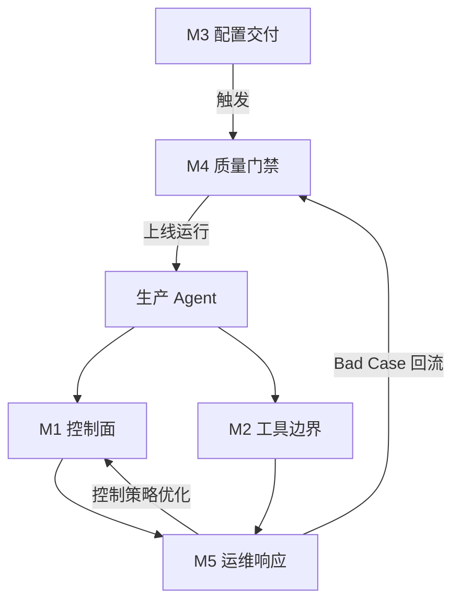
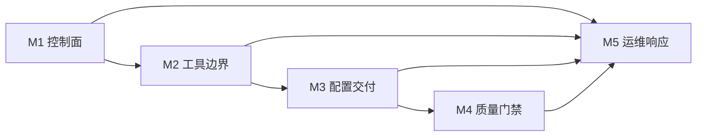

# Track A 知识体系 · Agent 五条工程生命线

> **定位**：Greenhand **第一站**——回答「为什么学 M1–M5」「每块解决什么生产问题」「对生产 Agent 系统覆盖度如何」「26 K 点的 What / Why / How 在哪」。  
> **机理教案**：[`COURSE.md`](01-course.md) · **索引速查**：[`KNOWLEDGE-MAP.md`](../KNOWLEDGE-MAP.md) · **K 点详卡**：各 `module-XX/knowledge.md`

---

## 1. 从自测到课程：你在证明什么

Track A 起源于 **面试自测**：每项能力需 **讲清原理、举自己的例子、分析 bad case**。  
Residency v2 在此基础上加了一层 **系统教学**——先建立 mental model，再跑 TrackARuntime 拿证据。

| 层次 | 回答的问题 | 主要文档 |
|---|---|---|
| **Why** | 为什么学、模块从哪来、覆盖度如何 | **本文件** §2–§3 + `COURSE.md` §0 |
| **What / How** | 概念与机制 | `COURSE.md` + `module-XX/knowledge.md` |
| **Prove** | 能否通过自测 / Exit | Rubric · Drills · Runtime 证据 |

**与「会用 ChatGPT 写代码」的分界**：Track A 证明你能 **工程化交付与运维 AI Agent 系统**——控制面可靠、工具可审计、配置可发布、质量有门禁、线上有 SOP。

---

## 2. 五条工程生命线 → 五个模块

生产 Agent 系统有五条 **缺一不可** 的工程生命线。M1–M5 即这五条线的 **最小可验证切片**（在 TrackARuntime 上落地）。

```text
用户任务进入
  │
  ├─ ① 控制面能否可靠跑完？          → M1 Agent 闭环（Control Plane）
  ├─ ② 工具边界是否可审计、可观测？    → M2 Tool + Trace（Tool Boundary）
  ├─ ③ 配置/Prompt 能否安全发布？     → M3 Harness（Config Delivery）
  ├─ ④ 行为质量有无数据门禁？         → M4 Eval（Quality Gate）
  └─ ⑤ 线上坏了谁先干什么？           → M5 值班思维（Ops Response）
```

| 生命线 | 模块 | 考核句 | 不学会怎样 | 主证据 |
|---|---|---|---|---|
| ① 控制面 | **M1** | 我会 Agent 闭环 | loop 空转、fatal 当普通错误继续跑 | `state.json` |
| ② 工具边界 | **M2** | 我会 Tool + Trace | 越权副作用、timeout 误判、trace 说不清 | `trace.json` |
| ③ 配置交付 | **M3** | 我会 Harness | 改一句 Prompt 全量上线、满意度断崖 | `harness-report.json` |
| ④ 质量门禁 | **M4** | 我会 Eval | merge 靠感觉、失败无法分类指导 fix | `evaluation-report.md` |
| ⑤ 运维响应 | **M5** | 我会值班思维 | 告警来了先换模型、在错误层打补丁 | SOP + mapping |

**为什么是 5 个而不是 6 个？** M6（作品集叙事）是 **对外表达** 层，不改变 M1–M5 的工程能力定义；本知识体系 **只聚焦 M1–M5**。

---

## 3. M1–M5 能力覆盖度深度解析

> **视角**：从「生产级 LLM Agent / 工作流系统」的全生命周期出发，评估五条生命线对 **工程化交付与运维** 的覆盖深度——不仅对照传统 DevOps/SRE，更强调 Agent **确定性低、自主性高** 带来的特有风险。

### 3.1 总评

M1–M5 的划分 **精准且务实**，几乎串联起 Agent 系统从 **变更交付 → 质量门禁 → 在线运行 → 故障响应 → 回流改进** 的完整链路。相对「生产级大模型 Agent 平台」的典型需求，本框架在 **运行安全、变更交付、质量评测、故障运维** 四维的覆盖约 **85%+**。

它不仅覆盖传统 DevOps/SRE 关注点，更抓住 Agent 特有风险：**会不会停、会不会瞎转、工具会不会越权、配置会不会抖、质量有没有数据门禁、线上坏了谁先干什么**。

### 3.2 各模块覆盖度

| 模块 | 覆盖核心 | 深度点评 | 评级 |
|---|---|---|---|
| **M1 控制面** | 系统 **稳定性与终结性** | Agent 最核心的痛点：传统软件不会自己死循环刷账单。M1 关注「会不会停」（死循环、Token 熔断）与「会不会瞎转」（幻觉无效迭代、Tool Call 失败后原地踏步）——决定 Agent 能否跨出 Demo 真正上线 | ★★★★★ |
| **M2 工具边界** | 运行时 **安全** 与 **可观测性** | Agent 的强大在于 Tool Call，风险也在于此。「工具会不会越权」直击 Prompt 注入与越权执行；「observe 会不会说谎」关注 Trace 链路真实性——防止被错误 tool 返回欺骗或伪造执行结果 | ★★★★★ |
| **M3 配置交付** | **CI/CD 稳定交付** | Agent 的「配置」不仅是环境变量，还包括 **Prompt、Model 路由、检索参数（Top-K/Threshold）**——轻微变动即可引发行为分布级抖动。Harness 灰度/影子测试是工程交付标配 | ★★★★☆ |
| **M4 质量门禁** | **数据驱动 Eval**（LLM-as-Judge / 回归） | 传统单测无法覆盖语义输出。「数据门禁」= 自动化、可量化 Eval 流水线（准确率、召回、幻觉率、安全分）；达不到 baseline 绝不发布——防范线上能力退化的唯一手段 | ★★★★★ |
| **M5 运维响应** | **持续运营与故障兜底**（SRE） | 线上一定会有 Bad Case。关键在：能否快速感知？有无 Human-in-the-loop SOP？能否经 SOP 沉淀为 M4 Eval 集、进而优化 M1 控制面——构成 **运维飞轮** | ★★★★☆ |

### 3.3 闭环防御体系

五条生命线构成 **闭环防御**，而非五个孤立知识点：



```text
[M3 配置交付] ──> 触发 ──> [M4 质量门禁] ──> 上线运行
                               │
 ┌─────────────────────────────┴─────────────────────────────┐
 ▼                                                           ▼
[M1 控制面 · 运行中]                              [M2 工具边界 · 跟外部交互]
 │                                                           │
 └─────────────────────────────┬─────────────────────────────┘
                               ▼
                        [M5 运维响应 · Bad Case 回流] ──> 反馈到 M4 / M1
```

**结论**：这套指标足以支撑 **企业级 AI Agent 系统工程化落地**——务实、可验证，且直击 Agent 特有风险。

### 3.4 盲区、现有锚点与补充决策

从「生产级 Agent 平台」角度，仍有 **两个隐性维度** 未在模块编号中单独成块，但在本体系内 **已有部分锚点**。下表给出缺口说明、现有覆盖、Comment，以及 **是否新增 module / case** 的建议。

| 盲区 | 典型问题 | 现有锚点（本体系） | Comment | 是否新增 module？ | 是否新增 case？ |
|---|---|---|---|---|---|
| **成本与资源水位**（Cost & Rate Limit） | Agent 是 Token 消耗大户；Loop/Planning 可能在分钟内烧掉大量配额，或触发 LLM 供应商 TPM/RPM 熔断导致全线崩塌 | M1-K04 **cost_limit**（L3 扩展）；#803 **空转烧 Token**；`monitoring-layers.md` **cost_per_request**；Case 7 **SLO/延迟**（次：容量）；**[Case 09](../case-library/cases/case-09-token-burn-rate-limit-cascade.md)**（CTL+SLO 扩展） | **缺口在「显式化」而非「完全缺失」**：成本/配额目前散在 M1 终止层与 M5 监控层；Case 09 将「空转 → 429 雪崩」叙事补全 | **否** — 归入 **M1 控制面延伸** + **M3 护栏** + **M5 监控** | **已补充 [Case 09](../case-library/cases/case-09-token-burn-rate-limit-cascade.md)**（浅读扩展，对照 oss-803 / oss-4579） |
| **状态机与记忆管理**（State & Memory） | 长时运行 Agent 带状态；Context Window 膨胀、多轮 Memory 污染或错乱 | 故障轴 **CTX**；Case 3 **中间迷失**（M1/M5 深读）；Case 5 **灾难性遗忘**；Case 6 **多轮注入污染**（次 CTX）；M1-K02 **observe 检索质量** → replan | **缺口在「纵深」而非「零基础」**：CTX 轴与 Case 3/5/6 已覆盖「context 当稀缺资源」；但 **Memory 写入/版本/回滚**（偏好更新、错误上下文持久化）在 K 点矩阵中不如 loop/fingerprint 显式 | **否** — 属于 **M1 控制面（状态路由）** 与 **M4（长上下文 scenario）** 的延伸，不应拆成第六块工程模块 | **可选深化，非必须新建编号 Case**：优先在 **Case 3 SOP** 与 **M1 exit 监控项**（输入 token 分布、分层命中率）上加强；若补材料，可写 **Case 3 姊妹篇**（Memory 版本错乱）或强化 Case 4 **data time-travel** 的 memory 版本叙事，而非 Case 9 全新主线 |
| **M3 工程交付深度** | Prompt/检索参数变更的「分布级抖动」 | Case 2、#1491、Harness 全链路 | M3 评级 ★★★★☆：在线门禁完整，**离线 Eval 与 Harness 双门禁** 的对照已在 §9；对 Greenhand 已够用 | 否 | 否（Case 2 / #1491 已覆盖） |
| **M5 飞轮回流** | Bad Case → Eval 集 → 控制策略 | M5-K01 SOP、project-mapping、Case → M4 taxonomy | M5 评级 ★★★★☆：**机制表在 M1–M4，M5 是合成叙事层**——飞轮逻辑已在 §3.3 图表达 | 否 | 否；[Case 09](../case-library/cases/case-09-token-burn-rate-limit-cascade.md) 已作 M1-I04 / M5 扩展练习 |

#### 补充决策摘要

| 决策项 | 建议 | 理由 |
|---|---|---|
| 新增 **M6 工程模块**（成本 / 记忆） | **不建议** | M6 已保留为 **作品集叙事**；成本与记忆均可映射到 M1/M3/M5 与 CTX/SLO 轴，五条生命线 **最小完备集** 不被破坏 |
| 新增 **Case 9+ 主线 Case** | **已落地 Case 09** | [`case-09`](../case-library/cases/case-09-token-burn-rate-limit-cascade.md) + [`case-library/sops/`](../case-library/sops/) · **M1 Day1–3 Issue 4** + **M5 Day1–3 扩展** |
| 强化 **现有 K 点 / 案例** | **优先于开新模块** | M1-K04 写清 cost_limit 与 RPM 门禁；M5 监控层显式列 **429 / quota_exhausted**；Case 3 + Case 5 串讲 **CTX 轴** |

### 3.5 求职级补强：Production Extension Packs

> 详见 [`02-production-extension-packs.md`](02-production-extension-packs.md)。本节回答：如果目标不是只完成 Track A Exit，而是让系统软件工程师更稳地面向 Agent Development 岗位，还应补哪些生产能力。

M1–M5 是 **五条工程生命线**，不建议拆成 M6 工程模块；M6 继续保留为作品集叙事层。真实岗位会追问的 LLM Gateway、RAG、安全、分布式 runtime、Memory、Eval 可信度、Observability，应作为 **生产扩展包** 并回 M1–M5。

| 扩展包 | 解决的岗位追问 | 主归属 | 次归属 | 证明方式 |
|---|---|---|---|---|
| **P1 LLM Gateway + Cost + Rate Limit** | Provider 429/timeout/invalid JSON、fallback、成本水位怎么处理 | M3 | M1/M5 | provider error taxonomy、[Case 10](../case-library/cases/case-10-provider-rate-limit-fallback.md)、metrics |
| **P2 RAG + Knowledge System** | 检索错、生成错、引用不支持结论如何拆分 | M4 | M1/M3/M5 | RAG eval split、[Case 11](../case-library/cases/case-11-rag-stale-index-hallucination.md) |
| **P3 Security + Tool Sandbox + Privacy** | 模型带权限做错事、间接注入、secret 泄露怎么防 | M2 | M4/M5 | policy engine 表、SEC eval、[Case 12](../case-library/cases/case-12-indirect-prompt-injection-tool-abuse.md) + [SOP](../case-library/sops/sop-case-12-indirect-prompt-injection-tool-abuse.md) / [Case 17](../case-library/cases/case-17-secret-leakage-through-tool-trace.md) + [SOP](../case-library/sops/sop-case-17-secret-leakage-through-tool-trace.md) |
| **P4 Runtime Scale + Memory + State** | 多任务、worker 死亡、checkpoint、memory 污染怎么处理 | M1 | M2/M4/M5 | queue/lease 设计、[Case 13](../case-library/cases/case-13-worker-death-checkpoint-resume.md) + [SOP](../case-library/sops/sop-case-13-worker-death-checkpoint-resume.md) / [Case 14](../case-library/cases/case-14-memory-poisoning-version-rollback.md) + [SOP](../case-library/sops/sop-case-14-memory-poisoning-version-rollback.md) |
| **P5 Eval Reliability + Red Team** | Judge 本身不可靠、样本波动、红队场景怎么处理 | M4 | M3/M5 | judge calibration、dataset lifecycle、[Case 15](../case-library/cases/case-15-judge-bias-false-regression.md) |
| **P6 Observability + SLO + Portfolio** | 如何从本地 trace 走向 OTel、dashboard、alert、SLO 和作品集 | M5 | M2/M3/M4 | OTel span 对照、[Case 16](../case-library/cases/case-16-observability-cardinality-alert-fatigue.md) + [SOP](../case-library/sops/sop-case-16-observability-cardinality-alert-fatigue.md) / [Case 18](../case-library/cases/case-18-approval-fatigue-destructive-action.md) + [SOP](../case-library/sops/sop-case-18-approval-fatigue-destructive-action.md)、portfolio |

**核心 Exit 不变**：原 26 K 点仍是 Track A 最低过关线。  
**求职增强 Exit**：读完 `02` 后，应能从 P1–P6 各讲 1 个生产 Case，并说明它如何映射回 M1–M5、现有 Runtime 已覆盖什么、仍缺什么。

---

## 4. 模块顺序与依赖



| 顺序 | 理由 |
|---|---|
| M1 最先 | 无可靠 loop，后续 trace/harness/eval 都无从谈起 |
| M2 紧随 | act 发生在 loop 内；tool 是 observe 的 **数据来源** |
| M3 在 M2 后 | 配置发布影响 **全局行为分布**，需先理解单次 run 的 trace |
| M4 在 M3 后 | Eval 是 merge 前 **全任务集回归**；Harness 是在线单变更门禁——互补 |
| M5 最后 | **合成层**：把 M1–M4 证据文件串成故障响应叙事，不是新机制 |

**M5 不是「第六块新知识」**，而是问：告警来了，你 **先打开哪个文件、在哪一层止血**。

---

## 5. 与传统软件对照（Greenhand 锚点）

| Agent 概念 | 传统系统等价 | 模块 |
|---|---|---|
| Agent loop / FSM | 工作流引擎（BPMN）、Saga 补偿 | M1 |
| observe 结构化信号 | 传感器读数、health check → branch | M1 |
| Tool allowlist | API Gateway 路由、sudoers | M2 |
| Trace span | OpenTelemetry 分布式追踪 | M2 |
| Prompt 版本 + gray | 配置中心 + Feature flag + Canary | M3 |
| 护栏 SLO / rollback | 错误预算、蓝绿回退 | M3 |
| Eval scenarios + gate | 集成测试套件 + CI block merge | M4 |
| failure taxonomy | HTTP 错误码分类 | M4 |
| 五步 SOP + 监控分层 | SRE on-call、RED/USE 指标 | M5 |

若你熟悉后端/DevOps，Track A 本质是：**把 LLM Agent 放进已有的工程纪律里**，而不是发明一套 AI 玄学。

---

## 6. TrackARuntime 在知识体系中的位置

TrackARuntime 是 **五条生命线的统一考场**——不是第五个模块，而是 M1–M4 的 **证据生成器** + M5 的 **映射靶场**。

```text
cli.py run [--llm mock]  → state.json + trace.json + metrics-*.json  (M1/M2)
cli.py harness           → harness-report (+ rollout)                 (M3)
cli.py eval --baseline auto|0.45 → evaluation-report                 (M4)
SOP 演习                 → 指上述文件 + mapping + metrics             (M5)
```

**刻意不教**（见 [`KNOWLEDGE-MAP.md` §10](../KNOWLEDGE-MAP.md)）：真实 LLM API、向量 RAG 平台、Jaeger 后端——这些不影响 M1–M5 的 **控制面 / 边界 / 交付 / 门禁 / 运维** 心智模型。教案与命令对齐见 [`01-course.md`](01-course.md)；原则：**所验 ⊆ 所学**。

---

## 7. 26 K 点 · What / Why / How 覆盖矩阵

> 详卡（Prove L1–L3、Issue 链接）：各 [`module-XX/knowledge.md`](../module-01/knowledge.md)  
> **教案过关命令**：[`01-course.md`](01-course.md) 各课「过关动作」· 索引速查：[`KNOWLEDGE-MAP.md` §8](../KNOWLEDGE-MAP.md)

### M1 · 控制面（6 K）

| ID | What | Why | How（TrackARuntime · 传统等价） |
|---|---|---|---|
| M1-K01 | Agent = 带 round/phase 的状态机，非 Chat | 无状态机则无法审计「第几轮、为何停」 | `loop_engine.py` Phase + `context_manager`（摘要层）· 工作流引擎 |
| M1-K02 | observe = 结构化 branch 信号，非 log | 无 branch 信号 → 无法 replan/fatal → silent loop | `_observe_tests` · health check |
| M1-K03 | replan = 读 observation 后的补偿策略 | blind retry 无进展，浪费轮次与成本 | `_make_plan` + 可选 `MockLLMClient` · Saga forward recovery |
| M1-K04 | 多层终止 max_rounds / checkpoint / cost | 单靠 max_rounds 无法修复 fatal 或 silent loop | `LoopConfig` + checkpoint/resume · 断路器（cost 硬限仍为 L3） |
| M1-K05 | retryable / recoverable / fatal 三分 | 分类错 → fatal 进 replan 或 recoverable 不 replan | `errors.py` · 异常层级 |
| M1-K06 | fingerprint 跨轮 (tool,args) 重复检测 | 单步 observe 正确但无 progress → 假 replan | `_check_fingerprint_loop` · meta 断路器 |

### M2 · 工具边界（5 K）

| ID | What | Why | How |
|---|---|---|---|
| M2-K01 | Tool = allowlist 内受控 RPC（含只读沙箱） | 任意 shell → 越权副作用不可审计 | `ALLOWLIST` + 真实 `read_file`/`grep`（主 loop 默认未调）· API Gateway |
| M2-K02 | Trace = 按序可回放执行图 | 面试/值班需逐步物证，非日志堆砌 | `trace.py` TraceEvent · OTel span |
| M2-K03 | 三层防御 allowlist→schema→HITL | 坏请求进 handler 才失败 → 无效 replan | `ToolSpec` / schema / `--require-hitl`（dry-run 仍 L3）· WAF |
| M2-K04 | 分路径 timeout tier | 全局 30s 误杀 build/test（#7355） | `_timeouts` 配置有、**enforce 未接线** · 按路由 SLA |
| M2-K05 | timeout ≠ kill；in_flight / stalled | 切太早 vs 永不切（#7355 / #8448）两极 | observe 契约 · `demo-no-output-hang` |

### M3 · 配置交付（6 K）

| ID | What | Why | How |
|---|---|---|---|
| M3-K01 | Harness = Prompt/配置的交付层 + 平台 stub | 与 Agent loop 混淆 → 靠换模型救火 | `pipeline.py` + router/token/cost stub · 配置中心 |
| M3-K02 | Prompt = 版本化代码 + changelog | 改一句 warm → 分布级偏移（Case 2） | `prompts/v1.yaml` / `v2.yaml` · Git diff |
| M3-K03 | 护栏 SLI vs SLO 阈值（formality；成本仅记账） | 「感觉还行」无法自动 rollback | `guardrails.py` formality · 错误预算 |
| M3-K04 | rollback_to_v1 自动回滚 | 坏 Prompt 全量扩散 | `run_harness()` · 蓝绿回退 |
| M3-K05 | gray_percent 金丝雀 | 大 bang 发布风险 | `gray_percent=10` · Canary |
| M3-K06 | re-ask 上限 + 边界安全 | 无界 re-ask = Harness 内 silent loop | #1491 概念 · validator 循环熔断 |

### M4 · 质量门禁（5 K）

| ID | What | Why | How |
|---|---|---|---|
| M4-K01 | Eval = 固定 scenarios 任务集（`_simulate`） | 手工试 prompt 不可重复、不可回归 | `scenarios.json` + category/version · SWE-bench 类比 |
| M4-K02 | failure taxonomy + remediation | 仅 pass/fail% 无法指导改检索还是 plan | `failure_taxonomy.md` · HTTP 错误码 |
| M4-K03 | gate_pass；baseline 固定或 auto | merge 靠感觉 → 线上 regression | `baseline.py` / CI **0.45** · CI block |
| M4-K04 | 检索 vs 生成 metric 拆分 | chunks 对、答案错（#9415）被误判为 RAG 问题 | `category_split` · 分层断言 |
| M4-K05 | trace-based loop metric | final output 像完成但 trace 空转（#2643） | `trace_eval.py` **未接入** runner · M1-K06 离线版 |

### M5 · 运维响应（4 K）

| ID | What | Why | How |
|---|---|---|---|
| M5-K01 | 五步 SOP 固定计时 | panic 式「改 Prompt 试试」扩大事故 | 观察→隔离→定位→修复→复盘 |
| M5-K02 | 系统等价物 | 非 LLM 背景面试官听不懂根因 | Case → 分布式系统映射 |
| M5-K03 | 监控五层（含 metrics 证据） | 在错误层打补丁（Case 7 ASR 无效） | monitoring-layers · TTFT/tool P95 / `metrics-*.json`（无告警通道） |
| M5-K04 | project-mapping | Case 与己项目脱节 → 面试无例子 | 现象→监控→证据→回滚 四列 |

**覆盖度自检**：上表 26 行均含 What / Why / How；Prove（L1–L3）见各 module `knowledge.md` **Prove** 段。

### 7.1 所学 ↔ 所验（命令全库对齐）

> **规则**：过关命令出现的能力，必须在同模块 **COURSE + knowledge** 已教；未实现能力只考「诚实缺口口述」，不考「假装会用」。

| 课 / 模块 | 所学（COURSE 机制要点） | 所验（最低过关命令） | 证据 |
|---|---|---|---|
| **M1** | 状态机；observe/fatal；replan≠blind；fingerprint；**MockLLM / context / checkpoint / metrics** | `run --llm mock`；`--simulate-container-death 1`；`--always-fail-tests --max-rounds 5`；`--pseudo-replan`；可选 `--checkpoint-dir` / `--resume-from` | `state.json` · `trace.json` · `metrics-*.json` |
| **M2** | allowlist→**schema→HITL**；timeout 两极；`_timeouts` 配置有/enforce 无；只读沙箱主路径未用 | `demo-allowlist`；`demo-no-output-hang`；`run --llm mock`；`--require-hitl`；schema 单测 | `trace.json` · `m2-8448-demo/` |
| **M3** | Prompt 版本/gray/formality/rollback；**router/token/cost stub（只记账）** | `harness --prompt v2 --gray-percent 10`；`harness --prompt v1 --gray-percent 0`；L3 `--watch`；兼看 `run --llm mock`→metrics | `harness-report.json` · `rollout-state.json` · metrics |
| **M4** | scenarios+`_simulate`；taxonomy+remediation；**baseline auto vs 0.45**；`category_split`；`trace_eval` 未接线 | `eval --baseline auto`（对照 `eval --baseline 0.45`） | `evaluation-report.md/.json` |
| **M5** | SOP 五步；监控五层；mapping；**观察步含 metrics**；无告警通道 | 文档填表 + 口述；证据复用 M1–M4 命令产出 | monitoring-layers · project-mapping |

**PowerShell 命令全库（与 COURSE / MAP / TrackARuntime README 一致）**：

```powershell
cd TrackARuntime

# M1
python cli.py run --task "fix failing test" --llm mock
python cli.py run --task "container death" --simulate-container-death 1
python cli.py run --task "stuck loop" --always-fail-tests --max-rounds 5
python cli.py run --task "pseudo replan" --always-fail-tests --pseudo-replan --max-rounds 5
python cli.py run --task "ckpt" --llm mock --checkpoint-dir m1_m2/evidence/checkpoints

# M2
python cli.py demo-allowlist --tool rm_rf
python cli.py demo-no-output-hang --idle-timeout 1
python cli.py run --task "hitl check" --require-hitl
python -m unittest tests.test_tool_executor -v

# M3
python cli.py harness --prompt v2 --gray-percent 10
python cli.py harness --prompt v1 --gray-percent 0
python cli.py harness --reset-rollout

# M4
python cli.py eval --baseline auto
python cli.py eval --baseline 0.45

# 工程门禁（非单模块 Exit，但体系要求知晓）
python scripts/self_check.py
python -m unittest discover tests
```

---

## 8. 故障分类轴 × 生命线（何时在哪层拦住）

> 完整定义：[`case-library/README.md`](../case-library/README.md)

| 轴 | 含义 | 应拦截的生命线 | 代表 |
|---|---|---|---|
| **OBS** | observe 信号层级错 | ① 控制面 | oss-803 |
| **CTL** | 控制面未 enforce | ① 控制面 | oss-4575/5099 |
| **CTX** | 上下文/记忆 | ① + ④ | Case 3 |
| **KNW** | 检索与知识 | ④ 质量门禁 | #9415 |
| **REL** | 交付与变更 | ③ 配置交付 | Case 2 · #1491 |
| **SEC** | 信任边界 | ② 工具边界 | Case 6 |
| **SLO** | 性能/容量 | ② + ⑤ | Case 7 · #7355 |
| **MET** | 度量与实验 | ③ + ④ | Case 8 · #929 |

**M5 的角色**：告警来了，按轴判断 **先亮哪一层监控、打开哪个证据文件**——不是再学一套新理论。

---

## 9. 跨模块高频对照（学完后应能串讲）

| 对照 | 说明 |
|---|---|
| **state vs trace** | M1 叙事 vs M2 逐步事实 |
| **allowlist vs formality** | M2 入口护栏 vs M3 出口护栏 |
| **fingerprint vs loop metric** | M1 在线 fatal vs M4 离线 eval |
| **harness rollback vs eval gate** | M3 在线 vs M4 merge 前双门禁 |
| **#7355 vs #8448** | timeout 切太早 vs hang 永不切 |
| **Case 7 vs Case 2** | 先开 trace vs harness-report |
| **M2 设计 vs M5 值班** | mechanism 表 vs SOP 动作表 |

---

## 10. 推荐学习路径

### Greenhand（首次）

1. **本文件** §2–§5（建立世界观：生命线 + 覆盖度 + 依赖 + 传统对照）
2. 本文件 **§7.1**（所学↔所验 + 命令全库）
3. [`COURSE.md`](01-course.md) 第 0 章 + 对应课
4. `module-XX/knowledge.md` 逐 K 点读 What/Why/How（含 Issue 覆盖标注）
5. Issue Day1–3 → TrackARuntime → rubric → drill

### 复习 / 面试前

1. 本文件 §7 矩阵 + **§7.1** + §9 对照
2. [`KNOWLEDGE-MAP.md`](../KNOWLEDGE-MAP.md) 术语 + §8 命令速查
3. [`INTERVIEW-DRILLS.md`](../interview/DRILLS.md)

### 自测过关

Exit 门槛不变：该模块核心 K **均分 ≥ 2.0**，且 **≥ 1 个 K = 3**（[`MASTERY-RUBRIC.md`](../MASTERY-RUBRIC.md)）。

---

## 11. 文档分层（避免「到处搜」）

| 文档 | 角色 | 何时读 |
|---|---|---|
| **KNOWLEDGE-SYSTEM.md**（本文件） | 世界观 + 覆盖度评估 + 26 K 矩阵 + **§7.1 所学↔所验** | Greenhand 第一站 |
| **COURSE.md** | 逐课机理 + 过关动作（与 §7.1 对齐） | 系统学习主读 |
| **production-extension-packs.md** | 求职增强：LLM Gateway / RAG / Security / Runtime Scale / Eval Reliability / Observability 如何并回 M1–M5 | 核心 Exit 后、面试前 |
| **KNOWLEDGE-MAP.md** | 纯索引速查 | 复习/面试查术语命令 |
| **module-XX/knowledge.md** | K 点详卡 + Prove | 深读单点 |
| **module-XX/GUIDE.md** | OSS 清单 + Runtime 命令 | 动手前 |
| **Rubric / Drills / Runtime** | 自测引擎 | 证明过关 |

---

## 变更记录

| 日期 | 变更 |
|---|---|
| 2026-08-07 | 新增 §3.5 Production Extension Packs：把 LLM Gateway、RAG、安全、Runtime Scale、Eval 可信度、Observability 作为求职增强并回 M1–M5 |
| 2026-07-28 | 新增 §7.1 所学↔所验 + 命令全库；§6 证据链含 metrics；与 `01-course.md` / `KNOWLEDGE-MAP` 对齐 |
| 2026-07-28 | §7 How 列同步 TrackARuntime Phase B–D：schema/HITL、checkpoint、baseline auto、平台 stub、`trace_eval` 未接线等诚实边界；详卡见各 module `knowledge.md` |
| 2026-07 | §3.4 落地扩展 Case 09（Token 空转 / 配额雪崩） |
| 2026-07 | 新增 §3 能力覆盖度深度解析（M1–M5 评级、闭环图、盲区与 module/case 补充决策）；后续章节顺延编号 |
| 2026-07 | 初版：五条生命线 + 26 K What/Why/How 矩阵 + 故障轴映射 |
