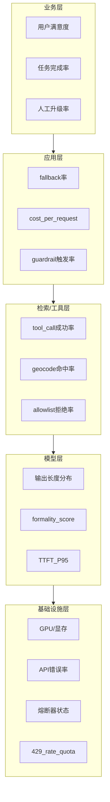

# AI 系统监控分层

（面试白板 — 自填你的项目指标名）  
Case 与层的对应见 [`case-library/README.md`](../case-library/README.md) 与各 Case 文末「监控与回滚」。

## 各层告警示例（填写）

| 层 | 指标 | 阈值 | 告警动作 |
|---|---|---|---|
| 业务 | | | |
| 应用 | | | |
| 检索/工具 | | | |
| 模型 | | | |
| 基础设施 | | | |

## 与 Bad Case 的映射

| Case | 最先亮的层 |
|---|---|
| 1 RAG 幻觉 | 检索层相似度低 + 业务层无引用回答 |
| 2 Prompt 漂移 | 模型层风格向量 + 业务满意度 |
| 3 中间迷失 | 检索层命中率异常 |
| 4 时间穿越 | 检索层版本冲突 |
| 5 灾难性遗忘 | 模型层通用能力 eval |
| 6 注入攻击 | 应用层情感极性 + guardrail |
| 7 延迟雪崩 | 模型层 TTFT + 基础设施超时 |
| 8 幸存者偏差 | 业务层分层指标不一致 |
| 9 配额雪崩（扩展） | 应用层 cost_per_request + 基础设施 **429 率** + 控制面 llm_calls/run |
